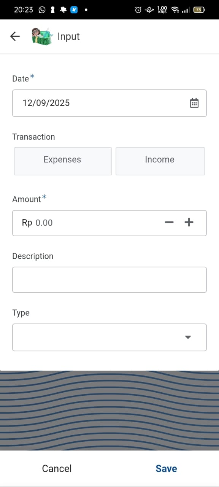
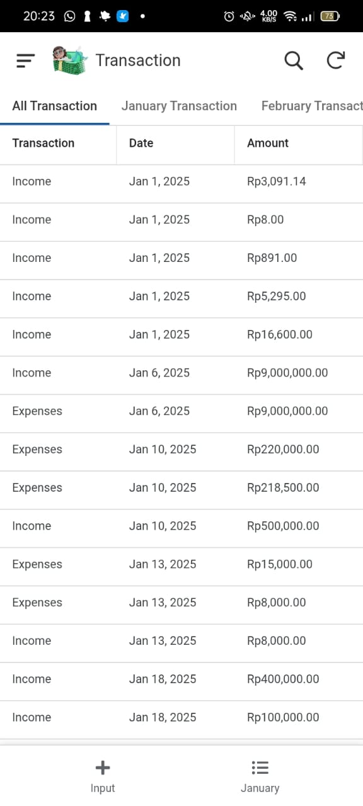
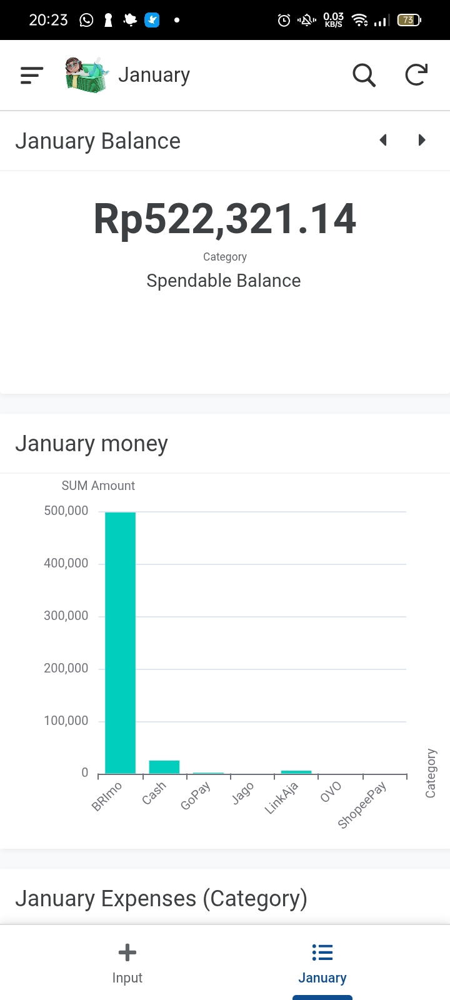
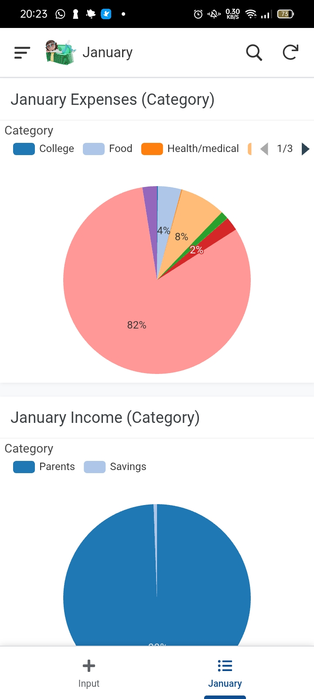

# Additional Automation Projects

## 1. Smart Monthly Budget (AppSheet Integration)

Proyek ini adalah hasil **modifikasi dan pengembangan (enhancement)** dari template standar "Monthly Budget" milik Google. Spreadsheet statis dari template diubah menjadi basis data dinamis yang terintegrasi dengan **AppSheet** (No-Code Mobile Apps).

### he Evolution (Before vs After)

| Fitur | 📄 Google Template (Original) | My Enhanced Version |
| :--- | :--- | :--- |
| **Metode Input** | Ketik manual di sel Excel/Sheets (Laptop). | Input via **Aplikasi HP** (AppSheet Interface). |
| **Fleksibilitas** | Harus buka browser dan cari baris kosong. | Input *on-the-go* (saat belanja langsung catat). |
| **Struktur Data** | Statis, hanya tabel standar. | Dinamis, disesuaikan untuk sinkronisasi Database AppSheet. |

### Problem & Solution:
Mencatat pengeluaran harian menggunakan template bawaan Google terasa kaku karena harus membuka laptop.
* **Solusi:** Saya menghubungkan spreadsheet ini sebagai *backend database* untuk AppSheet.
* **Hasil:** Saya bisa mencatat Pemasukan & Pengeluaran layaknya menggunakan aplikasi keuangan premium, namun dengan fleksibilitas kustomisasi penuh di Google Sheets.

**Perbandingan:**

Perbedaan antara template asli Google yang masih kstandar dengan versi yang sudah dikembangkan.

  
  &nbsp;&nbsp;&nbsp;
  

*(Link ke-2 berisi Master Sheet yang sudah terhubung dengan AppSheet log)*

### 📱 User Interface (Mobile View)
Aplikasi ini dirancang untuk kemudahan input data *on-the-go*.

<table border="0">
 <tr>
   <td align="center">
      
    </td>
    <td align="center">
      
    </td>
   <td align="center">
      
     </td>
   <td align="center">
      
     </td>
 </tr>
</table>

---

## 2. Relations Department Activity Log System

Sistem pencatatan terpusat yang dirancang untuk Departemen Relasi guna memantau kinerja dan riwayat aktivitas tim secara *real-time*.

### 💡 Key Features:
* **Centralized Database:** Menggantikan pencatatan manual/buku log konvensional menjadi database digital yang mudah dicari (*searchable*).
* **Activity Categorization:** Pengelompokan otomatis jenis kegiatan (Internal/Eksternal) untuk kemudahan pelaporan bulanan.
* **Performance Tracking:** Memudahkan ketua departemen memantau keaktifan anggota tim melalui *timestamp* log.

> **Impact:** Meningkatkan akuntabilitas anggota tim.

**Akses Database Log:**

  

*(Spreadsheet ini berisi format log aktivitas yang digunakan oleh departemen)*

---
