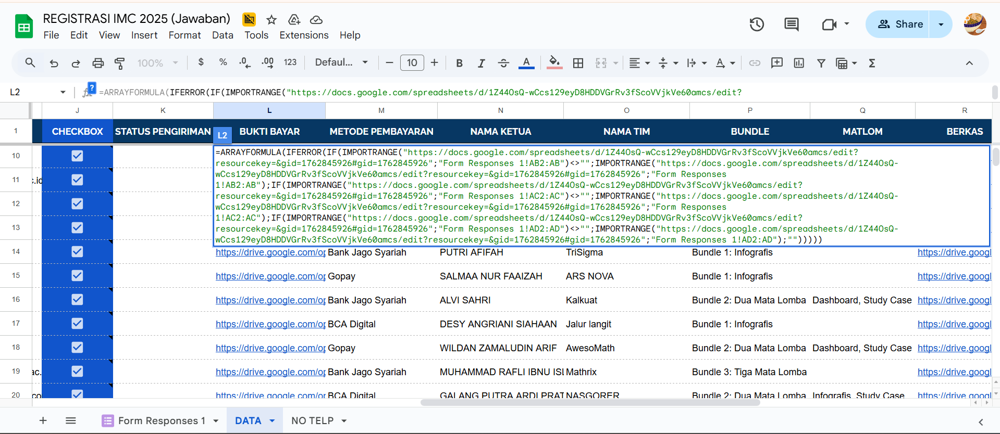

# 🚀 Otomatisasi Verifikasi & Notifikasi Peserta IMC 2025

 

**Role:** Automation Developer & Data Integrator  
**Goal:** Menggantikan verifikasi manual yang lambat dengan sistem *gate-check* otomatis & notifikasi *real-time*.

---

## 🛠️ System Workflow (Arsitektur)

Sistem menggunakan logika **Two-Stage Verification** untuk memastikan validitas data sebelum email dikirim.


*(Gambar 1: Alur data dari Google Form → Validasi Sekretaris → Validasi Bendahara → Email Otomatis)*

**Langkah Teknis:**
1.  **Ingestion:** Data masuk via Google Form → `Form Responses`.
2.  **Processing:** `QUERY` & `IMPORTRANGE` memindahkan data ke *Master Sheet*.
3.  **Logic:** `ARRAYFORMULA` melakukan *cleaning* dan konsolidasi kolom pembayaran yang terpisah-pisah.
4.  **Gate Check:**
    * *Gate 1:* Sekretaris validasi berkas (`BERKAS OK?`).
    * *Gate 2:* Bendahara validasi bayar (`CHECKBOX`).
5.  **Automation:** Centang Bendahara men-trigger **Apps Script** → Kirim Email HTML.

---

## 💻 Technical Highlights

### 1. Complex Data Consolidation (Google Sheets)
Tantangan utama adalah data pembayaran yang terpecah di 3 kolom berbeda (tergantung pilihan Bundle peserta). Saya menggunakan *nested IF* dalam *Array Formula* untuk menyatukan data tersebut secara dinamis.



```excel
// Snippet Logika Formula Konsolidasi
=ARRAYFORMULA(IFERROR(
  IF(IMPORTRANGE("URL";"Responses!AB2:AB")<>""; IMPORTRANGE("URL";"Responses!AB2:AB");
  IF(IMPORTRANGE("URL";"Responses!AC2:AC")<>""; IMPORTRANGE("URL";"Responses!AC2:AC");
  IF(IMPORTRANGE("URL";"Responses!AD2:AD")<>""; IMPORTRANGE("URL";"Responses!AD2:AD"); "")))
))
