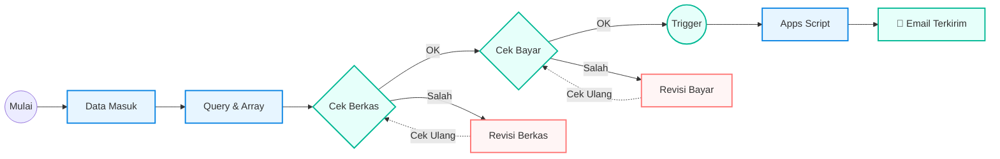

# 🚀 IMC 2025 – Automated Registration & Notification System


Sistem otomatisasi ini dirancang untuk menangani ribuan data peserta IMC 2025. Mengintegrasikan **Complex Spreadsheet Logic** dengan **Google Apps Script** untuk menghilangkan proses verifikasi manual yang rentan *human error*.

---

## 📌 Masalah & Solusi
| Masalah (Sebelumnya) | Solusi (Sistem Ini) |
| :--- | :--- |
| Data pembayaran terpecah di kolom berbeda (Bundle 1/2/3). | **Auto-Consolidation** menggunakan `ARRAYFORMULA` bersyarat. |
| Verifikasi manual satu per satu. | **2-Stage Gate Check** (Sekretaris & Bendahara). |
| Kirim email manual ke 4 orang per tim. | **Instan & Otomatis** mengirim email HTML ke seluruh anggota tim saat diverifikasi. |

---

## ⚙️ System Workflow

Diagram alur sistem dengan logika verifikasi bertingkat dan siklus revisi (*Feedback Loop*).


### 📝 Penjelasan Detail Alur Kerja (Workflow Breakdown)

Berdasarkan diagram di atas, sistem bekerja dengan **Logika Pengecekan Bertahap (Multi-Stage Verification)** yang terdiri dari tiga fase utama:

#### 1. Ingestion & Processing (Biru)
* **Data Entry:** Peserta mengisi Google Form.
* **Auto-Cleaning:** Data mentah langsung diproses oleh rumus `QUERY` dan `ARRAYFORMULA` di sheet `DATA` untuk memisahkan bukti bayar dan merapikan format teks.

#### 2. Verification Gates & Feedback Loop (Hijau & Merah)
Ini adalah inti dari kontrol kualitas data. Terdapat dua gerbang (*gate*) verifikasi:

* **Gate 1: Cek Berkas (Sekretaris)**
    * Sekretaris memeriksa validitas dokumen (KTM, Surat Aktif).
    * ✅ **Jika Valid:** Lanjut ke Gate 2.
    * 🔄 **Jika Salah (Looping):** Status menjadi "Revisi". Sekretaris menghubungi peserta. Setelah peserta memperbaiki berkas, Sekretaris melakukan **Cek Ulang** (kembali ke awal Gate 1).

* **Gate 2: Cek Bayar (Bendahara)**
    * Bendahara mencocokkan nominal transfer dengan bukti upload.
    * ✅ **Jika Valid:** Bendahara mencentang `CHECKBOX` (Trigger).
    * 🔄 **Jika Salah (Looping):** Status "Revisi Bayar". Peserta diminta transfer ulang/konfirmasi. Setelah beres, Bendahara melakukan **Cek Ulang** (kembali ke awal Gate 2).

#### 3. Automation Execution (Biru Muda)
* **Trigger:** Centang pada kolom Bendahara (`TRUE`) secara otomatis memicu Apps Script.
* **Action:** Script mengirim email notifikasi HTML ke seluruh anggota tim dalam hitungan detik.
* **Finish:** Proses selesai, peserta terkonfirmasi.

---

### 3. Apps Script: Event-Driven Automation
Sistem ini menggunakan *Custom Script* yang ditulis dalam JavaScript (Google Apps Script) untuk menangani logika pengiriman email secara backend.

**Fitur Kunci Script:**
* ⚡ **Smart Trigger (`onEdit`):** Skrip didesain presisi untuk hanya aktif jika (dan hanya jika) kolom **CHECKBOX** (Kolom J) dicentang. Edit di kolom lain tidak akan memicu skrip, menghemat kuota eksekusi Google.
* 🛡️ **Anti-Spam Guardrail:** Mencegah email ganda! Sebelum mengirim, skrip mengecek "Cell Note". Jika sudah ada catatan "Terkirim", proses dibatalkan otomatis.
* 🎨 **HTML Templating:** Email yang dikirim bukan teks biasa, melainkan HTML yang dirender dengan logo *branding* IMC dan tombol CTA (Call to Action) ke grup WhatsApp.

👇 **Klik link di bawah untuk membaca kode lengkapnya:**

[**📂 LIHAT SOURCE CODE APPS SCRIPT (kirimEmailVerifikasiTim.js)**](scripts/kirimEmailVerifikasiTim.js)

*(Link di atas akan membuka file kodingan langsung di repository ini)*

---

## 📸 Tampilan Sistem

### **1. Dashboard Verifikasi (Google Sheets)**
Menggunakan *Conditional Formatting* dan *Data Validation* untuk memudahkan panitia.


### **2. Output: Email HTML Otomatis**
Email yang diterima peserta berisi sapaan personal dan tombol CTA (Call to Action).


---

## 🧠 Core Technology (Technical Deep Dive)

Bagian ini menjelaskan logika kompleks yang berjalan di belakang layar.

### 1. Google Sheets: Dynamic Data Consolidation
Tantangan utama adalah menyatukan data bukti bayar yang tersebar di kolom berbeda tergantung pilihan paket peserta. Saya menggunakan **Nested IF didalam ArrayFormula**:

```excel
=ARRAYFORMULA(IFERROR(
  IF(IMPORTRANGE("URL";"Responses!AB2:AB")<>""; IMPORTRANGE("URL";"Responses!AB2:AB");
  IF(IMPORTRANGE("URL";"Responses!AC2:AC")<>""; IMPORTRANGE("URL";"Responses!AC2:AC");
  IF(IMPORTRANGE("URL";"Responses!AD2:AD")<>""; IMPORTRANGE("URL";"Responses!AD2:AD"); "")))
))

---

## 👥 Contributors & Credits

Project ini adalah hasil kolaborasi teknis yang erat. Meskipun memiliki spesialisasi utama, kami berdua memiliki pemahaman *full-stack* terhadap sistem ini (Excel ↔ Apps Script).

| Nama Anggota | Peran & Fokus Utama | Kontribusi Spesifik |
| :--- | :--- | :--- |
| **Gita Lavena Yumandari** | **Lead System Architect & Excel Specialist** | Merancang algoritma alur kerja (*workflow*), mendesain arsitektur database, serta menyusun logika rumus kompleks (`QUERY`, `ARRAYFORMULA`, `Validation`). |
| **Yohanes Deo Pringgondani** | **Automation Engineer (Apps Script)** | Mengimplementasikan kode otomatisasi backend, logika *trigger* `onEdit`, dan *rendering* template email HTML. |

> *Kedua kontributor memiliki pemahaman teknis yang menyeluruh terhadap seluruh ekosistem proyek ini dan mampu melakukan maintenance lintas-divisi.*

---
