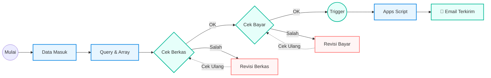
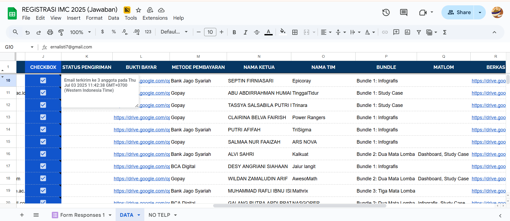
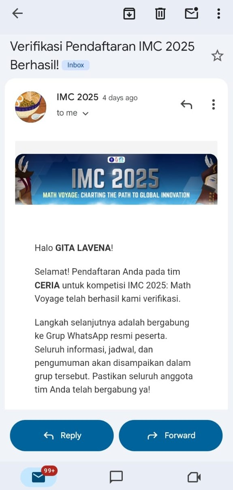
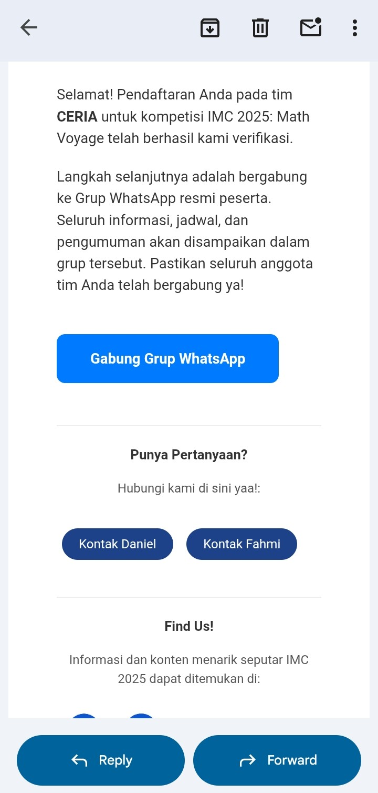

# Data Processing & Email Automation


Sistem otomatisasi ini dirancang untuk menangani ratusan data peserta IMC 2025. Mengintegrasikan **Complex Spreadsheet Logic** dengan **Google Apps Script** untuk menghilangkan proses verifikasi manual yang rentan *human error*.

---

## Masalah & Solusi
| Masalah (Sebelumnya) | Solusi (Sistem Ini) |
| :--- | :--- |
| Data pembayaran terpecah di kolom berbeda (Bundle 1/2/3). | **Auto-Consolidation** menggunakan `ARRAYFORMULA` bersyarat. |
| Verifikasi manual satu per satu. | **2-Stage Gate Check** (Sekretaris & Bendahara). |
| Kirim email manual ke 3-4 orang per tim untuk puluhan tim. | **Instan & Otomatis** mengirim email HTML ke seluruh anggota tim saat diverifikasi. |

---

## System Workflow

Diagram alur sistem dengan logika verifikasi bertingkat dan siklus revisi (*Feedback Loop*).


### Penjelasan Detail Alur Kerja (Workflow Breakdown)

Berdasarkan diagram di atas, sistem bekerja dengan **Logika Pengecekan Bertahap (Multi-Stage Verification)** yang terdiri dari tiga fase utama:

#### 1. Ingestion & Processing (Biru)
* **Data Entry:** Peserta mengisi Google Form.
* **Auto-Cleaning:** Data mentah langsung diproses oleh rumus `QUERY` dan `ARRAYFORMULA` di sheet `DATA` untuk memisahkan bukti bayar dan merapikan format teks.

#### 2. Verification Gates & Feedback Loop (Hijau & Merah)
Ini adalah inti dari kontrol kualitas data. Terdapat dua gerbang (*gate*) verifikasi:

* **Gate 1: Cek Berkas (Sekretaris)**
    * Sekretaris memeriksa validitas dokumen (KTM, Surat Aktif).
    * ✅ **Jika Valid:** Lanjut ke Gate 2.
    * 🔄 **Jika Salah (Looping):** Status menjadi "Revisi". Sekretaris menghubungi peserta. Setelah peserta memperbaiki berkas, Sekretaris melakukan **Cek Ulang** (kembali ke awal Gate 1).

* **Gate 2: Cek Bayar (Bendahara)**
    * Bendahara mencocokkan nominal transfer dengan bukti upload.
    * ✅ **Jika Valid:** Bendahara mencentang `CHECKBOX` (Trigger).
    * 🔄 **Jika Salah (Looping):** Status "Revisi Bayar". Peserta diminta transfer ulang/konfirmasi. Setelah beres, Bendahara melakukan **Cek Ulang** (kembali ke awal Gate 2).

#### 3. Automation Execution (Biru Muda)
* **Trigger:** Centang pada kolom Bendahara (`TRUE`) secara otomatis memicu Apps Script.
* **Action:** Script mengirim email notifikasi HTML ke seluruh anggota tim dalam hitungan detik.
* **Finish:** Proses selesai, peserta terkonfirmasi.

---

## Tampilan Sistem

### **1. Google Sheets**
Tampilan response asli dari Google Form.


Menggunakan *Conditional Formatting* dan *Data Validation* untuk memudahkan panitia.



### **2. Output: Email HTML Otomatis**
Email yang diterima peserta berisi sapaan personal dan tombol CTA (Call to Action).
<table border="0">
 <tr>
    <td align="center">
      
      <br>
    </td>
    <td align="center">
      
      <br>
    </td>
 </tr>
</table>

---

## Core Technology (Technical Deep Dive)

Bagian ini menjelaskan logika kompleks yang berjalan di belakang layar.

### 1. Google Sheets: Dynamic Data Consolidation
Tantangan utama adalah menyatukan data bukti bayar yang tersebar di kolom berbeda tergantung pilihan paket peserta. Untuk itu digunakan **Nested IF didalam ArrayFormula**:

```excel
=ARRAYFORMULA(IFERROR(
  IF(IMPORTRANGE("URL";"Responses!AB2:AB")<>""; IMPORTRANGE("URL";"Responses!AB2:AB");
  IF(IMPORTRANGE("URL";"Responses!AC2:AC")<>""; IMPORTRANGE("URL";"Responses!AC2:AC");
  IF(IMPORTRANGE("URL";"Responses!AD2:AD")<>""; IMPORTRANGE("URL";"Responses!AD2:AD"); "")))
))
```
### 2. Apps Script: Event-Driven Automation
Sistem ini menggunakan *Custom Script* yang ditulis dalam JavaScript (Google Apps Script) untuk menangani logika pengiriman email secara backend.

**Fitur Kunci Script:**
* **Smart Trigger (`onEdit`):** Skrip didesain presisi untuk hanya aktif jika (dan hanya jika) kolom **CHECKBOX** (Kolom J) dicentang. Edit di kolom lain tidak akan memicu skrip, menghemat kuota eksekusi Google.
* **Anti-Spam Guardrail:** Mencegah email ganda! Sebelum mengirim, skrip mengecek "Cell Note". Jika sudah ada catatan "Terkirim", proses dibatalkan otomatis.
* **HTML Templating:** Email yang dikirim bukan teks biasa, melainkan HTML yang dirender dengan logo *branding* IMC dan tombol CTA (Call to Action) ke grup WhatsApp.
**Klik link di bawah untuk membaca kode lengkapnya:**

[**LIHAT SOURCE CODE APPS SCRIPT**](scripts/kirimEmailVerifikasiTim.js)

*(Link di atas akan membuka file kodingan langsung di repository ini)*

---

## Live Demo: Simulasi Full System

Anda dapat mencoba simulasi penuh sistem ini. Karena sistem ini melibatkan integrasi data dan Apps Script, Anda perlu memiliki **salinan (copy) penuh** dari Google Sheet dan Google Form di akun Anda sendiri. 

Ikuti panduan langkah demi langkah di bawah ini:

### Langkah 1: Duplikasi Sistem (Copy Resources)
Salin kedua file (Sheet & Form) ke dalam Google Drive Anda agar Anda memiliki akses Admin penuh.

1.  **Salin Spreadsheet (Database & Script):**
    <p align="center">
      <a href="https://docs.google.com/spreadsheets/d/1Ur0bb94fzTWBmO_Zzy6FaArQExyXSvX2Yey0vqerKTI/edit?gid=1711213432#gid=1711213432">
        
      </a>
    </p>

2.  **Salin Google Form (Interface):**
    <p align="center">
      <a href="https://docs.google.com/forms/d/1jr_RStTkh-xsDpmBVrcdb9zRlGIYpMbqGGLgaaxgokk/edit">
        
      </a>
    </p>

---

### Langkah 2: Hubungkan Form ke Sheet (Linking)
Langkah ini krusial agar data form masuk ke Spreadsheet milik Anda.

1.  Buka **Google Form salinan Anda** (yang baru saja dicopy).
2.  Masuk ke tab **Responses** (Jawaban).
3.  Klik tanda titik tiga (`⋮`) di samping ikon Spreadsheet, atau klik **Link to Sheets**.
4.  Pilih opsi **"Select existing spreadsheet"** (Pilih spreadsheet yang ada).
5.  Pilih file **Spreadsheet salinan Anda** (dari Langkah 1).
    > *Sekarang, setiap kali form diisi, data akan masuk otomatis ke sheet salinan Anda.*

---

### Langkah 3: Aktifkan Apps Script (Authorization)
Agar email otomatis bisa berjalan, berikan izin pada script.

1.  Di Spreadsheet, buka menu **Extensions** > **Apps Script**.
2.  Pastikan fungsi `kirimEmailVerifikasiTim` terpilih, lalu klik **▶ Run**.
3.  Saat muncul *pop-up* izin: Klik **Review Permissions** ➡️ Pilih Akun Google ➡️ **Advanced** ➡️ **Go to (Nama Script) (Unsafe)** ➡️ **Allow**.

---

### Langkah 4: Uji Coba (Testing)
Saatnya simulasi!

1.  **Isi Form:** Klik tombol "Preview" (ikon mata 👁️) di Google Form Anda, lalu isi data (Gunakan email aktif Anda di kolom email peserta).
2.  **Cek Sheet:** Buka Spreadsheet sheet `Form Responses`, pastikan data masuk. Lalu cek sheet `DATA`, pastikan data ter-update via rumus.
3.  **Trigger Email:** Di sheet `DATA`, centang kolom **CHECKBOX** (Bendahara).
4.  **Hasil:** Cek Inbox email Anda. Notifikasi verifikasi akan muncul! 🎉

---

### 🔧 Troubleshooting (Jika Email Tidak Masuk)
Jika Anda sudah mencentang tapi email tidak muncul, ikuti langkah ini:

1.  **Cek "Cell Note":** Arahkan mouse ke sel Checkbox yang Anda centang.
    * Jika ada segitiga kecil di pojok sel, arahkan mouse ke sana.
    * Jika tulisannya "Email terkirim...", berarti sukses.
    * Jika tulisannya "Gagal Kirim...", berarti ada masalah izin.
2.  **Reset Status:**
    * **Hapus Centang** pada checkbox.
    * **Klik Kanan** pada sel tersebut ➡️ Pilih **Delete notes** (Hapus catatan). *Ini penting! Karena sistem tidak akan mengirim ulang jika Note masih ada.*
3.  **Coba Lagi:** Centang kembali checkbox tersebut setelah memastikan langkah *Authorization* (Langkah 1) sudah benar.
4.  Atau, silakan isi ulang Google Form untuk mendapatkan baris data baru yang bersih.
**Data tidak masuk ke Sheet?** Ulangi Langkah 2, pastikan Anda memilih Spreadsheet yang benar saat menghubungkan Form.

---

## 👥 Kontributor

 
> Perancangan alur sistem (workflow), arsitektur database, dan logika rumus kompleks (`QUERY`/`ARRAYFORMULA`).

 
> Implementasi kode backend, penanganan *trigger* otomatisasi, dan sistem *rendering* email HTML.

<br>

> **Cross-Functional Collaboration:** Proyek ini dikerjakan dengan prinsip *Cross-Functional*. Kedua kontributor memiliki pemahaman penuh (*Full-Stack*) terhadap seluruh sistem, sehingga mampu menangani logika Excel maupun koding Apps Script secara bergantian (*interchangeable*).

---
